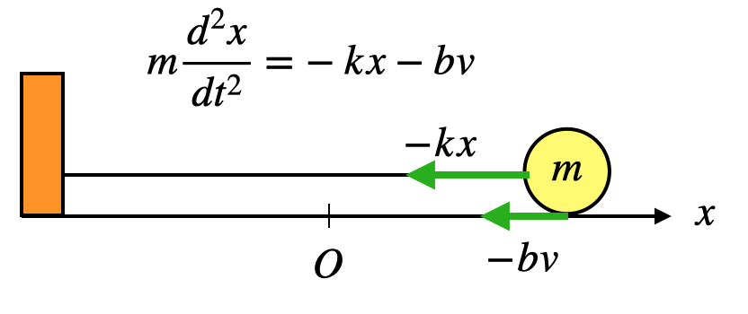

# RungeKutta

N階常微分方程式をRungeKutta法で解くクラス。  
定義は

```c++
template <std::size_t N>
class RungeKuttaSimul;

template <std::size_t N>
class RungeKutta;
```

クラスRungeKuttaSimulは連立常微分方程式  


を解くためのクラスで、クラスRungeKuttaは常微分方程式


を解くためのクラス。後者は前者を継承している。おそらくRungeKuttaの方をよく使うと思う。ここでは、クラスRungeKuttaの使い方の方を解説する。
　
# 基本的な使い方

例えば２階常微分方程式 y''= -y を初期値 y(0)=0, y'(0)=1で解きたい場合、

```c++
#include "RungeKutta.hh"

int main(){
  RungeKutta<2> rk; // 2階微分方程式を解きたいので、テンプレートの引数には2を入れる。
  auto f = [](double x, double *y){
    return -y[0];
  };
  // 必ず関数は double hogehoge(double x, double* y) の形にする。y[i]は yの i 階微分の意味。
  // 今は、f(x, y, y') = -y なので、このようになる。
  rk.AssignFunction(f); // 関数を Assign する。
  double y[2] = {0, 1}; // 初期値。第一引数から順に、y, y' の初期値を入れる。x は次で入れる。
  rk.SetInitValues(0, y); // 初期値をセットする。第一引数はxの初期値、次にyの初期値となる。x=0 で y(0)=0, y'()=1の意味。
  rk.SetStep(0.001); // xの刻み幅を変える。初期値は0.001になっている。特になくてもよい。
  rk.Solve(5); // x = 5まで解く。0.001刻みでx=0から5までの約5000点を配列に詰め込んでいる。
  rk.WriteFile("hogehoge.txt"); // 結果をテキストファイルに書き込む。刻み幅とxの大きさによってはかなりサイズが大きくなるので注意。
  return 0;
}

```
 
因みにこの結果をプロットすると、以下のようにsinカーブとなる。  


解が入っている配列にアクセスするために、以下のような関数が用意されてある。

```c++
double GetValueX(double const& i);
double GetValueY(double const& i, double const& k);
```

詳細はメンバ関数の項を参照。


# メンバ関数

```c++
RungeKuttaSimul();
~RungeKuttaSimul();

RungeKutta();
~RungeKutta();
```
コンストラクタとデストラクタ。引数は与えない。

---

```c++
void SetInitValues(double x, double* y);
```

初期値を設定する。第一引数は x の初期値。第二引数に y, y', ... y^(n-1) (y^(i)はyの i 階微分)の初期値を配列の先頭ポインタとして渡す。

---

```c++
void SetStep(double const& step);
```
xの刻み幅を変える。初期値は0.001となっている。

---

```c++
void SetMaximumX(double x_max);
```

x の定義域の最大値を設定する。(現在この関数を使う意味はない。)

---

```c++
void AssignFunction(std::function<double(double, double*)> func);
```

微分方程式 y^(n)=f(x,y,y',...y^(n-1)) の右辺 f をセットする。fの形は引数の型を見ればわかるように、double function(double x, double* y) の形でなければならない。例えば、f = x - y + y' - y'' の場合は、
```c++
double func(double x, double *y){
  return x - y[0] + y[1] - y[2]; 
}
```

のように定義する。y[i]はyの i 階微分の項である。因みに、この関数は
```c++
void AssignFunction(int i_func, std::function<double(double, double*)> func);
```
という定義も存在するが、これは連立微分方程式を解く時に使う関数。(これも元気な時に解説する。)

---

```c++
void Solve(double const& x_max);
```

微分方程式を x = x_max までの範囲で解く。この関数が実行された後はクラス内に解が入った配列が生成される。

---

```c++
int64_t GetSize();
```

微分方程式の解が入った配列の大きさを取得する。

---

```c++
double GetValueX(double const& i);
double GetValueY(double const& i, double const& k);
```

(GetValueX) : 解の配列のうち、x のi番目の値を取得する。0.001 刻みでx=0~5まで解いた場合、i=0 -> x=0, i=1 -> x=0.001,... という構造になっている。  
(GetValueY) : 解の配列のうち、y^(k) のi番目の値を取得する。k は y の k 階微分を意味する。(0 <= k < N)

---

```c++
void WriteFile(std::string filename);
```

微分方程式の解をファイルに書き込む。引数にファイル名を指定する。フォーマットは x y y' y'' ... という風になっている。

# 色々な使い方

[1]  
途中で方程式の形を変えることもできる。例えば、0 <= x <= 1 までの範囲は y'' = 1 で、1 <= x <= 2 までの範囲は y'' = -1 と記述されていたとする。初期値はy(0)=y'(0)=0とする。
もちろん解は 0 <= x <= 1 の範囲でy=1/2x^2, 1 <= x <= 2 の範囲で y = -1/2(x-2)^2 + 1 だが、あえて数値計算で解く場合には次のように書けば良い。

```c++
  // includeなどは適宜補完してください。
  RungeKutta<2> rk;
  auto f1 = [](double x, double* y){return 1;};
  auto f2 = [](double x, double* y){return -1;}; //２つ用意しておく
  rk.AssignFunction(f1); // f1の方をセットする。
  double y[2] = { 0, 0 }; // 初期値
  rk.SetInitValues(0, y); // 初期値のセット
  rk.Solve(1); // x=1まで解く。
  rk.AssignFunction(f2); // 次にf2をセットする。
  rk.Solve(2); // x=2まで解く。
```

これを実際にプロットすると次のようになる。x=1で切り替わっているのがわかる。


---

[2]  
物理学をはじめとする自然科学の法則の多くは微分方程式で記述されるが、多くの場合は計算が煩雑ないしは解析的に解けないこともある。そういう時は数値計算で解の挙動を調べることができる。例として下図のような、バネ定数 k のバネにつながれた質量 m の物体が床からの摩擦 -bv (vは物体の速度)を受けながら振動する系を考える(因みに、この系は手計算で解くことができる)。運動方程式は図に書かれてある通りの式になる。これを数値計算で解いてみる。



```c++
    RungeKutta<2> rk;
    double k = 10; // バネ定数 10 [N/m]
    double m = 0.1; // 質量 0.1 [kg]
    double b = 0.3; // 摩擦の比例定数。 0.3 [Ns/m]
    auto f1 = [&](double t, double* x){return -k / m * x[0] - b / m * x[1];}; // 方程式右辺
    rk.AssignFunction(f1);
    double x[2] = { 1, 0 }; // t=0 で 初期位置 x = 1 [m], 初期速度 v = 0 [m/s] だったとする。
    rk.SetInitValues(0, x);
    rk.Solve(3); // 3秒先の時間発展を見る。
```

得られた結果をx-tグラフとしてプロットすると下図になる。摩擦によって減衰していくのが見て取れる。


