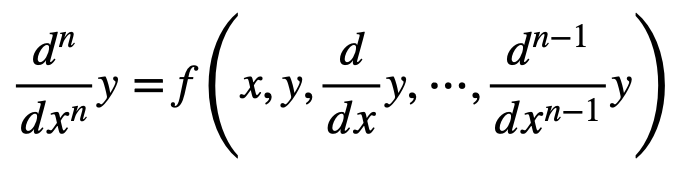

# RungeKutta

N階常微分方程式をRungeKutta法で解くクラス。  
定義は

```c++
template <std::size_t N>
class RungeKuttaSimul;

template <std::size_t N>
class RungeKutta;
```

クラスRungeKuttaSimulは連立常微分方程式  


を解くためのクラスで、クラスRungeKuttaは常微分方程式



を解くためのクラス。後者は前者を継承している。おそらくRungeKuttaの方をよく使うと思う。

# 基本的な使い方

RungeKutta\<N\>
--
例えば２階常微分方程式 y''= -y を初期値 y(0)=0, y'(0)=1で解きたい場合、

```c++
#include "RungeKutta.hh"

int main(){
  RungeKutta<2> rk; // 2階微分方程式を解きたいので、テンプレートの引数には2を入れる。
  auto f = [](double x, const double *y){
    return -y[0];
  };
  // 必ず関数は double hogehoge(double x, const double* y) の形にする。y[i]は yの i 階微分の意味。
  // 今は、f(x, y, y') = -y なので、このようになる。
  rk.AssignFunction(f); // 関数を Assign する。
  double y[2] = {0, 1}; // 初期値。第一引数から順に、y, y' の初期値を入れる。x は次で入れる。
  rk.SetInitValues(0, y); // 初期値をセットする。第一引数はxの初期値、次にyの初期値となる。x=0 で y(0)=0, y'(0)=1の意味。
  rk.SetStep(0.001); // xの刻み幅を変える。初期値は0.001になっている。特になくてもよい。
  rk.Solve(5); // x = 5まで解く。0.001刻みでx=0から5までの約5000点を配列に詰め込んでいる。
  rk.WriteFile("hogehoge.txt"); // 結果をテキストファイルに書き込む。刻み幅とxの大きさによってはかなりサイズが大きくなるので注意。
  return 0;
}

```
因みにこの結果をプロットすると、以下のようにsinカーブとなる。  


解が入っている配列にアクセスするために、以下のような関数が用意されてある。

```c++
double GetValueX(double i);
double GetValueY(double i, double k);
```

詳細はメンバ関数の項を参照。

RungeKuttaSimul\<N\>
--

例として、x(t)とy(t)に関する連立微分方程式 x'(t)=-y(t) y'(t)=x(t) を初期条件x(0)=0, y(0)=1で解く場合を示す。(上記の連立微分方程式において、x -> t, y_0 -> x, y_1 -> y となっているので注意。あくまで、x(今の場合はt)は媒介変数と捉える。)
```c++
#include "RungeKuttaSimul.hh"

int main(){
  RungeKuttaSimul<2> rk_simul; // 今は2元連立微分方程式を考えているので、テンプレートの引数は2
  auto f0 = [](double t, const double* x) {return -x[1];}; // x'(t)=-y(t)
  auto f1 = [](double t, const double* x) {return x[0];}; // y'(t)=x(t)
  rk_simul.AssignFunction(0, f0); // 0番目の式の右辺における関数をセットする
  rk_simul.AssignFunction(1, f1); // 1番目の式の右辺における関数をセットする
  rk_simul.SetInitValues(0, { 0, 1 }); // 初期値。t=0 で x(0)=0, y(0)=1 だったとする。
  rk_simul.SetMaximumX(6.2); // tの最大値を6.2までに設定する。
  rk_simul.Solve(6.2); // t = 0 ~ 6.2 の範囲で微分方程式を解く。
}
```
tを0~6.2まで動かした時のx,yの値をプロットすると下図のようになる(縦軸がy, 横軸がx)。  
(x, y) = (0, 1)から始まって、時計回りに円軌道を描く。(t=2πで一周する)


ちなみに、連立方程式の中に二階以上の微分が含まれている場合も、1階の連立微分方程式に帰着できる。例えば、y''=-yという式があったとしても、新しく z = y' とすれば z' = -y, y' = z の二つの1階連立微分方程式に分解できる。(実はRungeKuttaクラスは1階の連立微分方程式に帰着させて解いているだけである。)

# メンバ関数

```c++
RungeKuttaSimul();
~RungeKuttaSimul();

RungeKutta();
~RungeKutta();
```
コンストラクタとデストラクタ。引数は与えない。

---

```c++
void SetInitValues(double x, double* y);
void SetInitValues(double x, std::initializer_list<double> y);
```

初期値を設定する。第一引数は x の初期値。第二引数に y, y', ... y^(n-1) (y^(i)はyの i 階微分)の初期値を配列の先頭ポインタ、もしくは初期化子リストとして渡す。
```c++
// 例
RungeKutta<3> rk;
double y[3] = {0, 1, 0};
rk.SetInitValues(0, y); // x = 0 で y = 0, y' = 1, y'' = 0の意味
// rk.SetInitValues(0, {0, 1, 0}); としても可。
```

---

```c++
void SetStep(double step);
```
xの刻み幅を変える。初期値は0.001となっている。

---

```c++
void SetMaximumX(double x_max);
```

x の定義域の最大値を設定する。(内部的にはこの関数を呼び出したあとvectorのメモリをreserveで確保する。したがって、push_backによるコピーが発生しないため、微分方程式を解く速度が速くなる。)

---

```c++
void AssignFunction(std::function<double(double, const double*)> func); // (1) RungeKutta 用
void AssignFunction(int i_func, std::function<double(double, const double*)> func); // (2) RungeKuttaSimul 用
```

(1) 微分方程式 y^(n)=f(x,y,y',...y^(n-1)) の右辺 f をセットする。fの形は引数の型を見ればわかるように、`double function(double x, const double* y)` の形でなければならない。例えば、f = x - y + y' - y'' の場合は、
```c++
double func(double x, const double *y){
  return x - y[0] + y[1] - y[2]; 
}
```
のように定義する。y[i]はyの i 階微分の項である。  
(2) 連立微分方程式を解く時に使う関数。`i_func` は y_i' = f_i(x,y_0,...y_n) の f_i に対応する。y[i]はそのままy_iに対応する。例えば、f_i = x - y_0 - y_1 のときは、
```c++
double func(double x, const double *y){
  return x - y[0] - y[1];
}
```
のように定義する。

---

```c++
void Solve(double x_max);
```

微分方程式を x = x_max までの範囲で解く。この関数が実行された後はクラス内に解が入った配列が生成される。

---

```c++
int64_t GetSize();
```

微分方程式の解が入った配列の大きさを取得する。

---

```c++
double GetValueX(double i);
double GetValueY(double i, double k);
```

(GetValueX) : 解の配列のうち、x のi番目の値を取得する。0.001 刻みでx=0~5まで解いた場合、i=0 -> x=0, i=1 -> x=0.001,..., i=5000 -> x=5.000, という構造になっている。  
(GetValueY) : 解の配列のうち、y^(k) のi番目の値を取得する。k は y の k 階微分を意味する。(0 <= k < N)

---

```c++
void WriteFile(const char* filename);
```

微分方程式の解をファイルに書き込む。引数にファイル名を指定する。フォーマットは x y y' y'' ... という風になっている。RungeKuttaSimulの場合は x y_0 y_1 ... となる。

# 色々な使い方

[1]  
途中で方程式の形を変えることもできる。例えば、0 <= x <= 1 までの範囲は y'' = 1 で、1 <= x <= 2 までの範囲は y'' = -1 と記述されていたとする。初期値はy(0)=y'(0)=0とする。
もちろん解は 0 <= x <= 1 の範囲でy=1/2x^2, 1 <= x <= 2 の範囲で y = -1/2(x-2)^2 + 1 だが、あえて数値計算で解く場合には次のように書けば良い。

```c++
  // includeなどは適宜補完してください。
  RungeKutta<2> rk;
  auto f1 = [](double x, const double* y){return 1;};
  auto f2 = [](double x, const double* y){return -1;}; //２つ用意しておく
  rk.AssignFunction(f1); // f1の方をセットする。
  double y[2] = { 0, 0 }; // 初期値
  rk.SetInitValues(0, y); // 初期値のセット
  rk.Solve(1); // x=1まで解く。
  rk.AssignFunction(f2); // 次にf2をセットする。
  rk.Solve(2); // x=2まで解く。
```

これを実際にプロットすると次のようになる。x=1で切り替わっているのがわかる。


---

[2]  
物理学をはじめとする自然科学の法則の多くは微分方程式で記述されるが、多くの場合は計算が煩雑ないしは解析的に解けないこともある。そういう時は数値計算で解の挙動を調べることができる。例として下図のような、バネ定数 k のバネにつながれた質量 m の物体が床からの摩擦 -bv (vは物体の速度)を受けながら振動する系を考える(因みに、この系は手計算で解くことができる)。運動方程式は図に書かれてある通りの式になる。これを数値計算で解いてみる。


```c++
    RungeKutta<2> rk;
    double k = 10; // バネ定数 10 [N/m]
    double m = 0.1; // 質量 0.1 [kg]
    double b = 0.3; // 摩擦の比例定数。 0.3 [Ns/m]
    auto f1 = [&](double t, const double* x){return -k / m * x[0] - b / m * x[1];}; // 方程式右辺
    rk.AssignFunction(f1);
    rk.SetMaximumX(3);
    rk.SetInitValues(0, { 1, 0 });  // t=0 で 初期位置 x = 1 [m], 初期速度 v = 0 [m/s] だったとする。
    rk.Solve(3); // 3秒先の時間発展を見る。
```

得られた結果をx-tグラフとしてプロットすると下図になる。摩擦によって減衰していくのが見て取れる。


---

[3]  
昨今話題に上がる感染症に関するモデルにも微分方程式が使われている。最も簡単な感染症モデルとしてSIRモデルと呼ばれるものがある。このモデルは感染症の流行を定量的に分析・予測するために使われるもので、以下の3元連立微分方程式で記述される。


ここで、S(t)は時刻 t における感受性保持者(簡単に言えばまだ感染していない人)、I(t)は感染者数、R(t)は免疫保持者(あるいは隔離者)である(Wikipedia "SIRモデル", "https://ja.wikipedia.org/wiki/SIRモデル", 2020/12/24 引用)。パラメータ β, γはそれぞれ感染率と回復率と呼ばれる。このモデルにおいて重要(だと思われる)なパラメータは、R0=S(0)β/γ で定義される基本再生産数という量で、感染者の1人がまだ誰も感染していない人の集団に対して平均何人感染させるかを表す量である。
この微分方程式を、初期条件 S(0)=999, I(0)=1, R(0)=0 で解く。

```c++
    RungeKuttaSimul<3> rk_simul;
    double beta = 0.0003; // β
    double gamma = 0.1; // γ
    auto S = [&](double t, const double* T) {return -beta * T[0] * T[1];};  
    auto I = [&](double t, const double* T) {return beta * T[0] * T[1] - gamma * T[1];};
    auto R = [&](double t, const double* T) {return gamma * T[1];};
    // S, I, Rを代表させてTと書いてある。今の場合は T[0]=S, T[1]=I, T[2]=R
    rk_simul.AssignFunction(0, S);
    rk_simul.AssignFunction(1, I);
    rk_simul.AssignFunction(2, R);
    rk_simul.SetInitValues(0, { 999, 1, 0 }); // 初期値。S(0)=999, I(0)=1, R(0)=0。今の場合、基本再生産数 R0 ~ 3である。
    rk_simul.SetMaximumX(100);
    rk_simul.Solve(100);
```

上のコードで解いたとき(R0 ~ 3)の、S(赤), I(黄緑), R(青) の時間発展の様子は下図のようになる。


また、β = 0.002, γ = 0.1 (R0 ~ 2)の時で解いた時のグラフは下図になる。


基本再生産数 R0 ~ 3の場合は、短期で感染が拡大して結果的に約 94% の人が感染している。一方、R0 ~ 2の場合では比較的ゆるやかに感染者が増え、感染者数も80%(それでも8割...)に抑えられており、ピークも遅くなっている。このような傾向はR0に対して敏感であるようだ。基本再生産数は流行するか否かの指標に用いられ、R0 > 1 のときに感染が拡大する。インフルエンザは２〜３と言われている。感染症が流行し免疫保持者が増えてくると、新たに感染症を移す人数の平均はR0とは異なってくる。この量を実行再生産数(Rで表す)という。実行再生産数 R も R < 1で流行が収束に向かい、感染症の蔓延度合いを見積もるためによく指標の一つに使われる。
